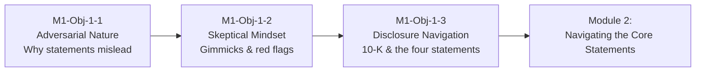

# Module 1: Foundations of Financial Statement Analysis

## Learning Objectives

| # | Learning Objective | Focus |
|---|---|---|
| **1.1** | **[[M1-Obj-1-1]]** — Understand financial statements and their adversarial nature | **Adversarial Reporting** — map vs. maze, shareholder-wealth incentive, cheap capital, the SEC/FASB/GAAP rulemaking chain, accrual vs. cash basis |
| **1.2** | **[[M1-Obj-1-2]]** — Identify reporting gimmicks and develop a skeptical mindset | **Skepticism** — proactive vs. mechanical analysis, earnings smoothing, big-bath, channel loading, cookie-jar reserves, gamesmanship, red flags |
| **1.3** | **[[M1-Obj-1-3]]** — Locate and navigate corporate financial disclosures | **Disclosure Navigation** — SEC EDGAR, the 10-K anatomy (MD&A, financial statements, notes), the four core statements, auditor opinions |

> [!info] Running Example: Tesla, Inc. — The Course-Long Thread
> This course uses **Tesla, Inc. (TSLA)** as its unified running example across Modules 1–4. Module 1 plants the seed: you locate Tesla's **FY2025 Form 10-K** on EDGAR and learn to read *adversarially* — not accepting its numbers at face value, but hunting for what the maze conceals.
> - **Here (M1)**: find the 10-K, map its parts, adopt a skeptical mindset toward its claims
> - **[[M2-Overview]]**: deconstruct Tesla's three core statements line by line
> - **[[M3-Overview]]**: measure Tesla's performance with vertical, horizontal, and Du Pont analysis
> - **[[M4-Overview]]**: explain and benchmark it against peer **BYD**
>
> Every concept in this module — the map/maze tension, management incentives, gimmick detection, disclosure navigation — is the analytical armor you carry through all four statements-based modules.

---

## Key Concepts

### The Skeptical Mindset (The Foundation of Everything That Follows)

| Concept | One-Line Takeaway | Tesla Connection |
|---|---|---|
| **Map vs. Maze** | Statements can clarify or bewilder — the analyst's job is to find the map in the maze | Tesla's consolidated statements must be read through footnotes and segment detail |
| **Shareholder-wealth incentive** | Management's duty is to shareholders, not to educate analysts | Explains why Tesla's narrative can outrun its numbers |
| **Adversarial stance** | Assume the burden of proof lies with the discloser | Motivates every skeptical check in Modules 2–4 |
| **Earnings quality** | Not all profits are created equal; accruals can be stretched | Sets up the revenue-recognition and margin-quality work of [[M2-Obj-2-2]] |
| **Proactive analysis** | Valuable analysis begins after the usual boxes are filled | Distinguishes the analyst who reads footnotes from the one who reads headlines |

### Why This Module Precedes the Numbers

You cannot measure what you do not trust to begin with. Module 1 installs the **detective mindset** before Module 2 teaches you to read the statements, Module 3 teaches you to measure them, and Module 4 teaches you to judge them against peers. The progression throughout the course is: **Skepticism → Measurement → Context → Interpretation → Prediction → Communication** (see [[Course-Overview]]).

---

## Module 1 Learning Flow

1. **Start with adversarial reality (1.1)** — understand *why* statements are motivated and therefore partial.
2. **Arm yourself with skepticism (1.2)** — learn the common gimmicks and the red flags that reveal them.
3. **Learn where to look (1.3)** — master EDGAR and the 10-K so you can find the evidence for every future analysis.
4. **Carry it forward** — Modules 2–4 reuse this foundation at every step; every ratio and every comparison is filtered through the skeptical lens built here.

---

## Prerequisites & Setup

- **No prior accounting required** — this module assumes only basic financial literacy
- **Open an account at the SEC EDGAR database** (free, no signup): https://www.sec.gov/edgar/searchedgar/companysearch
- **Bookmark Tesla, Inc. (TSLA)** — you will retrieve its FY2025 Form 10-K in the Module 1 practice activities and reuse it throughout Modules 2–4
- **A 10-K handy** — the inline Tesla 10-K viewer linked in [[M1-Obj-1-3]] lets you practice navigation immediately

---

## Book References

> [!info] Sources
> - Chapter 1: "The Adversarial Nature of Financial Reporting" in *Financial Statement Analysis: A Practitioner's Guide* (3rd Ed) by Martin Fridson and Fernando Alvarez.
> - Chapter 1: "Financial Statements: An Overview" in *Understanding Financial Statements* (12th Ed) by Lyn M. Fraser and Aileen Ormiston.

---

## Related Notes

- [[Course-Overview]] — Full course structure and learning stages
- [[M2-Overview]] — Module 2: Navigating the Core Financial Statements (next)
- [[M3-Overview]] — Module 3: Core Analytical Techniques
- [[M4-Overview]] — Module 4: Strategic and Industry Context
