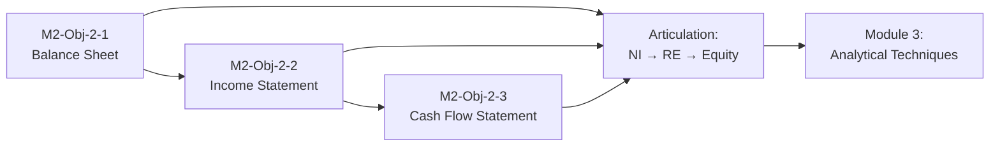

# Module 2: Navigating the Core Financial Statements

## Learning Objectives

| # | Learning Objective | Focus |
|---|---|---|
| **2.1** | **[[M2-Obj-2-1]]** — Deconstruct the classified Balance Sheet to evaluate asset quality, liability structures, off-balance-sheet hazards, and the elusiveness of "true" equity | **Balance Sheet** — classification, valuation (FIFO/LIFO, LCM, goodwill, intangibles), reserves, leases, pensions, equity components, book vs. market value |
| **2.2** | **[[M2-Obj-2-2]]** — Analyze the Income Statement to evaluate core earnings sustainability, cost structures, operating leverage, and qualitative earnings distortions | **Income Statement** — accrual vs. cash, ASC 606 revenue recognition, margin analysis, fixed vs. variable costs, operating leverage, SBC, regulatory credits, pro forma vs. GAAP, comprehensive income |
| **2.3** | **[[M2-Obj-2-3]]** — Deconstruct the Statement of Cash Flows to evaluate internal cash generation, corporate life cycles, financial flexibility, and strategic cash flow manipulation | **Cash Flow Statement** — CFO/CFI/CFF classification, indirect method reconciliation, free cash flow, business life cycle, financial flexibility, manipulation detection (AP stretch, capitalized expenses, factoring, deferred revenue) |

> [!info] Running Example: Tesla, Inc. (FY2025)
> All three learning objectives use **Tesla's FY2025 Form 10-K** as the integrated running example. This lets you trace how the same economic events flow through all three statements:
> - **Balance Sheet**: $137.8B assets, $42.8B APIC, $361M AOCI, $8.6B warranty reserve, $6.0B operating lease ROU
> - **Income Statement**: $94.8B revenue, 18% gross margin, 4.6% operating margin, $3.1B SBC, $2.0B regulatory credits
> - **Cash Flow**: $14.7B CFO, $8.5B CapEx, $6.2B FCF, $7.9B cumulative AP growth (2024–25), $1.9B CapEx in liabilities

---

## Key Concepts

### The Big Three — And How They Connect

| Statement | Answers | Tesla 2025 Snapshot |
|---|---|---|
| **Balance Sheet** (Point in time) | What does the company *own* and *owe*? | $137.8B assets = $54.9B liabilities + $82.1B equity |
| **Income Statement** (Period) | How much *value was created* (accrual)? | $3.9B net income, but $14.7B CFO — profits ≠ cash |
| **Cash Flow Statement** (Period) | Where did *actual cash* come from and go? | $14.7B ops, −$15.5B invest, +$1.1B financing |

> [!tip] The Articulation Principle
> The three statements are mathematically linked:
> - Net Income → **Retained Earnings** (Balance Sheet equity)
> - Net Income → **Starting point for CFO** (indirect method)
> - CFO + CFI + CFF = **ΔCash** (Balance Sheet cash)
> - CapEx → **PP&E** (Balance Sheet asset)
> - SBC → **APIC** (Balance Sheet equity)

### Supplementary Data (Equally Critical)
- **Statement of Stockholders' Equity** — The bridge: Net Income + SBC + OCI + Issuances = ΔEquity
- **Statement of Comprehensive Income** — Net Income + OCI (FX, unrealized gains, pension) = Comprehensive Income
- **Notes to Financial Statements** — Where the real detail lives (revenue recognition, SBC allocation, lease commitments, contingencies)
- **MD&A** — Management's narrative on trends, risks, and non-GAAP measures

### GAAP vs. IFRS — Key Divergences in This Module
| Topic | U.S. GAAP | IFRS |
|---|---|---|
| Balance sheet format | Liquidity order | Reverse liquidity |
| Inventory write-down reversal | Prohibited | Allowed up to original cost |
| LIFO inventory | Allowed | **Prohibited** |
| Lease classification | Finance vs. Operating (both on BS) | Single model (all on BS) |
| Revenue recognition | ASC 606 | IFRS 15 (substantially converged) |

---

## Module 2 Learning Flow

1. **Start with the Balance Sheet (2.1)** — Understand the *stock* of assets, liabilities, and equity at a point in time. Learn where accounting values diverge from economic reality.
2. **Move to the Income Statement (2.2)** — See how the *flows* of revenue and expense change equity. Learn where accrual estimates create manipulation risk.
3. **Finish with Cash Flows (2.3)** — Strip away accruals to see *actual cash generation*. Learn how the three statements articulate and where managers can distort the picture.
4. **Synthesize** — Use all three together in Module 3 (Vertical, Horizontal, Ratio Analysis).

---

## Prerequisites & Setup

- **Module 1 completed** — Adversarial mindset, gimmick detection, 10-K navigation
- **Tesla FY2025 10-K downloaded** — SEC EDGAR: `0001628280-26-003952` (or search TSLA 10-K 2025)
- **Spreadsheet ready** — For common-size, margin, and cash flow reconstruction exercises in Module 3

---
## Book References

> [!info] Sources
> - Chapter 2-4 in *Financial Statement Analysis: A Practitioner's Guide* (3rd Ed) by Martin Fridson and Fernando Alvarez.
> - Chapters 2–4 in *Understanding Financial Statements* (12th Ed) by Lyn M. Fraser and Aileen Ormiston.

---
## Related Notes

- [[Course-Overview]] — Full course structure and learning stages
- [[M1-Overview]] — Module 1: Foundations of Financial Statement Analysis
- [[M3-Overview]] — Module 3: Core Analytical Techniques (Vertical, Horizontal, Ratios)