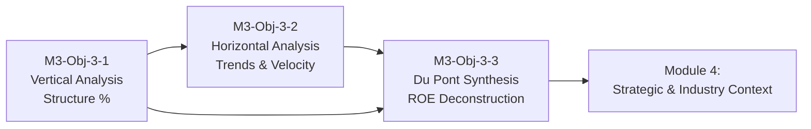

# Module 3: Core Analytical Techniques

## Learning Objectives

| # | Learning Objective | Focus |
|---|---|---|
| **3.1** | **[[M3-Obj-3-1]]** — Perform Vertical Analysis and calculate common-sizing ratio metrics to evaluate a company's internal structural mix | **Vertical Analysis** — common-sizing mechanics, base selection (Total Assets / Net Sales), structural asset & liability shares, gross/operating/net/cash-flow margins, debt-to-assets, equity cushion |
| **3.2** | **[[M3-Obj-3-2]]** — Implement Horizontal Analysis (Trend Analysis) to evaluate financial trajectories and establish operational velocity | **Horizontal Analysis** — YoY dollar/percentage changes, index-number trends, CAGR and earnings-quality adjustments, velocity ratios (DSO, DSI, DPO, cash conversion cycle), asset productivity, credit-cycle patterns |
| **3.3** | **[[M3-Obj-3-3]]** — Synthesize financial ratios through the Du Pont System to deconstruct Return on Equity (ROE) and evaluate sustainable growth | **Du Pont Synthesis** — classic ROA decomposition (turnover × margin), modified ROE decomposition (ROA × leverage), leverage amplification, Financial Leverage Index, EPS disaggregation, sustainable growth rate |

> [!info] Running Example: Tesla, Inc. (FY2023–FY2025)
> All three learning objectives use **three years of Tesla financial statements** (FY2023 & FY2025 Form 10-Ks) so every technique reads the *same* data through a different lens:
> - **Vertical (structure)**: gross margin flat at ~18% while operating margin halved to 4.6%; cash share up to 32% of assets; inventory share down to 9.0%; stable ~40/60 liabilities/equity split
> - **Horizontal (trajectory)**: R&D index at 161.5 vs. revenue at 98.0 (2023 = 100); CCC lengthened from 4.7 to 13.9 days; fixed asset turnover slid from 3.63× to 2.48×
> - **Du Pont (synthesis)**: ROE collapsed 27.9% → 5.0% with leverage flat at ~1.7× — a purely operational story; FLI easing 1.75 → 1.57; sustainable growth (g = ROE) of just 5.0% vs. assets compounding +13.7%/yr

---

## Key Concepts

### The Analytical Ladder — Three Lenses on the Same Numbers

| Technique                     | Question It Answers                   | Core Tools                                        | Time Orientation           |
| ----------------------------- | ------------------------------------- | ------------------------------------------------- | -------------------------- |
| **Vertical Analysis** (3.1)   | What is the internal *structure*?     | Common-size statements vs. a single base          | One period (a photo)       |
| **Horizontal Analysis** (3.2) | Which *direction* and how *fast*?     | YoY changes, index numbers, CAGR, velocity ratios | Multiple periods (a video) |
| **Du Pont Synthesis** (3.3)   | *Why* did returns move — which lever? | Ratio multiplication chains ending in ROE         | Integrated diagnosis       |

> [!tip] The Synthesis Chain
> The three objectives are cumulative, not parallel:
> - Vertical analysis supplies the **margins** (net margin 15.5% → 4.1%) and **structural shares** (PP&E creep)
> - Horizontal analysis supplies the **trajectories** (index divergence, turnover decay, CAGR)
> - Du Pont multiplies them together to explain **ROE** — and exposes whether returns came from operations or from debt risk

### Why Normalize at All?
Raw dollars punish small companies and flatter large ones. Common-sizing strips away size; trend analysis strips away single-period noise; Du Pont strips away financing effects (adjusted ROA) to isolate operating reality. Each technique is a different way of asking the analyst's core question: *what is actually going on here?*

---

## Module 3 Learning Flow

1. **Start with Vertical Analysis (3.1)** — Learn to normalize statements against a common base and read a company's internal structure like an X-ray.
2. **Add the time dimension (3.2)** — Track dollar changes, index numbers, and velocity ratios across periods to catch gradual drift early.
3. **Synthesize with Du Pont (3.3)** — Multiply margins, turnover, and leverage into ROE to diagnose *which lever* drove shareholder returns — and whether debt helped or inflated them.
4. **Carry it forward** — Modules 4+ embed these techniques inside industry and strategy analysis.

---

## Book References

> [!info] Sources
> - Chapters 13–14 in *Financial Statement Analysis: A Practitioner's Guide* (3rd Ed) by Martin Fridson and Fernando Alvarez.
> - Chapter 5 in *Understanding Financial Statements* (12th Ed) by Lyn M. Fraser and Aileen Ormiston.

---

## Prerequisites & Setup

- **Module 2 completed** — The Big Three statements and their articulation
- **Tesla 10-Ks available** — FY2025 filing (`tsla-20251231.htm`, SEC accession `0001628280-26-003952`) for 2025/2024/2023 figures, plus the FY2023 filing (`tsla-20231231.htm`) for December 31, 2022 opening balances used in average-based ratios
- **Spreadsheet ready** — For common-size tables, index-number series, CAGR, and Du Pont chain calculations in the practice activities

---

## Related Notes

- [[FSA-Skills-Ratio-Analysis]] — **Ratio skill card** — the full inventory of ratios and the questions they answer, for the big picture
- [[Course-Overview]] — Full course structure and learning stages
- [[M1-Overview]] — Module 1: Foundations of Financial Statement Analysis
- [[M2-Overview]] — Module 2: Navigating the Core Financial Statements
- [[M4-Overview]] — Module 4: Strategic and Industry Context
